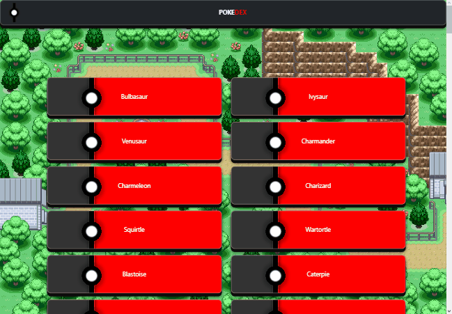
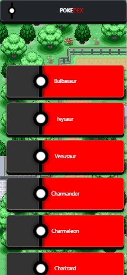

# Description
Pokedex App is a simple JavaScript app using the PokeAPI to displayed information about selected Pokemon.
Pokedex App presents a list of Pokemons, users can open each Pokemon to view stats "Height, Weight, Type, and Abilities".
Also presents a image of current Pokemon in view.

## Objective
To build a small web application with HTML, CSS, and JavaScript that loads data from an external API and enables the viewing of data points in detail.

## Table of Content
- [Project Setup](#setup)
- [Limit Change](#changing-the-limit)
- [Used](#used)
- [API](#api-used)

# [Pokedex App](https://vppelli.github.io/Pokedex-app/) Live
  

## Future Features
- The app should handle errors (such as trying to load data while offline) and show user-friendly error messages.
- Making the app more aesthetically pleasing or including more features, such as an item search
- Touch interactions (pointer events), e.g., swiping between items

 
## Setup
> A simple html file startup project!
- Clone the project: [Here](https://github.com/vppelli/Pokedex-app.git)
- Once you cloned it, use the index.html to preview the Pokedex App
- Inside the index.html; to access All Pokemon by [Changing the limit](https://github.com/vppelli/Pokedex-app/blob/main/README.md#too-change-limit)

- You can also download the files manually, and open the index.html to preview the Pokedex App
- Changing up css or javascript, the index.html is refrencing to .mini files located in __dist__ folder [here](./dist)

### Changing the limit
Go into dist folder [here](./dist/scripts.mini.js)
Open up the scripts.mini.js if you havent already, and find the API fetch link. Changing the end limit number will show more or less.
Example: https://pokeapi.co/api/v2/pokemon/?limit=1000 <-- showing 1000 Pokemon

## Used
- HTML
- JavaScript
- CSS
- Bootstrap

## API Used
PokeAPI: [https://pokeapi.co/api/v2/pokemon/](https://pokeapi.co/api/v2/pokemon/)

